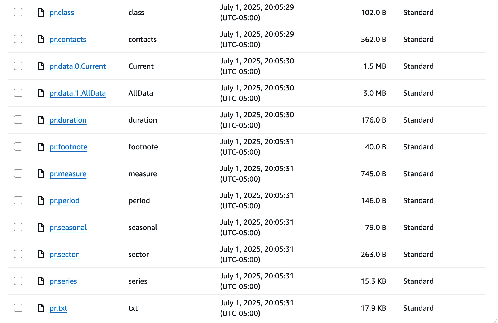
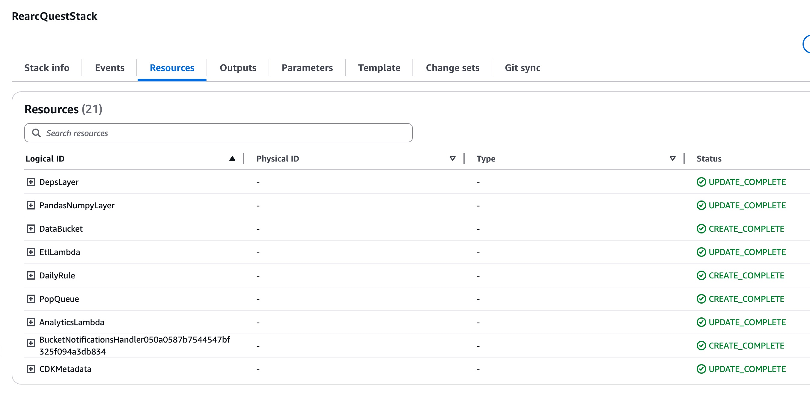
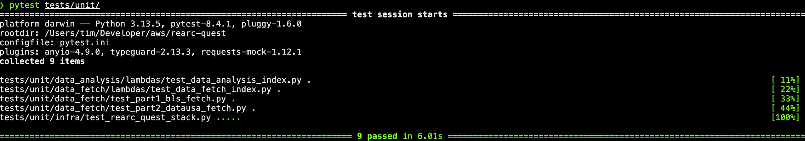

# Rearc Data Quest Submission

**Author:** Tim Marder  
**Region:** `us-east-1`  
**Repository:** https://github.com/TimMarder/rearc-quest  
**Public S3 Bucket (read-only):** https://rearcqueststack-databuckete3889a50-k7v0kjvuiqpy.s3.amazonaws.com/

---

## 📌 Overview

This project is a complete solution to the [Rearc Data Quest](https://github.com/rearc-data/quest). It showcases a data pipeline deployed via AWS CDK. The pipeline involves:

- Programmatic scraping of BLS data (CSV)
- Fetching JSON from the DataUSA API
- Storing outputs into a versioned S3 Bucket
- Triggering downstream analysis via SQS + Lambda
- Logging computed metrics to CloudWatch
- Infrastructure fully managed via IaC (AWS CDK)

---

## 🧱 Architecture

```
         ┌────────────┐                  ┌───────────────┐            ┌─────────────┐
Daily →  │ ETL Lambda │──fetch BLS/API──►│   S3  (data)  │──notify──► │    SQS      │
Schedule │ –sync BLS  │                  └───────────────┘            └─────────────┘
         │ –store pop │                                                ▲
         └────────────┘                                                │
                            Eventbridge trigger (S3 Notifications)     │
                                                 ┌─────────────────────┘
                                                 │
                                       ┌─────────▼────────┐              ┌───────────────┐
                                       │ Analytics Lambda │  ── logs ──► │   Cloudwatch  │
                                       └──────────────────┘              └───────────────┘
```

---

## 🗂️ Project Structure

```
rearc-quest/
├── app.py
├── requirements.txt
├── src/
│   ├── data_fetch/
│   │   ├── part1_bls_fetch.py          # BLS Sync helper
│   │   ├── part2_datausa_fetch.py      # DataUsa Fetch helper
│   │   ├── lambdas/            
│   │   │   └── index.py                # ETL Lambda handler
│   ├── data_analysis/
│   │   ├── lambdas/            
│   │   │   └── index.py                # Analytics Lambda handler
│   │   └── part3_data_analytics.ipynb  # Jupyter notebook analysis
│   └── infra/
│   │   └── rearc_quest_stack.py        # CDK Stack definition
├── tests/                              # Unit tests
├── requests_layer/python               # Layer with requests dependencies (local only)
└── lambda_layers/pandas_numpy/         # Prebuilt zipped Layer with pandas/numpy (local only)
```
                                       
---

## ✅ Part 1 – BLS Dataset Sync

- **Source:** https://download.bls.gov/pub/time.series/pr/
- **Destination:** `s3://rearcqueststack-databuckete3889a50-k7v0kjvuiqpy`
- **Public S3 Bucket (read-only):** https://rearcqueststack-databuckete3889a50-k7v0kjvuiqpy.s3.amazonaws.com/
- **Lambda:** `etl_lambda`
- **Run Frequency:** Daily (via EventBridge)

### Features

- Delta sync using file metadata (size & timestamp)
- Ignores duplicates
- Adds `User-Agent` header to comply with BLS robot policy

### Files currently in S3:



---

## ✅ Part 2 – Population API Fetch

- **API:** [DataUSA](https://datausa.io/api/data?drilldowns=Nation&measures=Population)
- **Destination S3 Key:** `datausa/<YYYY-MM-DD>.json` *(Will use latest day)*
- **Stored As:** JSON
- **Metadata:** Includes execution timestamp and lambda source

### Example Output

```json
{
  "data": [
    {
      "ID Nation": "01000US",
      "Nation": "United States",
      "ID Year": 2023,
      "Year": "2023",
      "Population": 332387540,
      "Slug Nation": "united-states"
    },
  "source": [
    {
      "measures": [
        "Population"
      ],
      "annotations": {
        "source_name": "Census Bureau",
        "source_description": "The American Community Survey (ACS) is conducted by the US Census and sent to a portion of the population every year.",
        "dataset_name": "ACS 5-year Estimate",
        "dataset_link": "http://www.census.gov/programs-surveys/acs/",
        "table_id": "B01003",
        "topic": "Diversity",
        "subtopic": "Demographics"
      },
      "name": "acs_yg_total_population_5",
      "substitutions": []
    }
}
```

---

## 📊 Part 3 – Data Analytics

Implemented as:

- **Notebook:** [part3_data_analytics.ipynb](https://github.com/TimMarder/rearc-quest/blob/main/src/data_analysis/part3_data_analytics.ipynb)
- **Lambda:** `analytics_lambda` *(logs results to CloudWatch)*

### 3.1 Mean and Standard Deviation of US Population (2013 – 2018)

| Metric | Value |
|--------|-------|
| Mean   | 317,437,383 |
| Std‑dev | 4,257,090 |

*(Results also logged to CloudWatch)*  
*(Results also saved as outputs in IPYNB file)*

### 3.2 Best Year by Series (sum of quarterly *value*)

| series_id   | best_year | year_sum |
|-------------|-----------|---------:|
| PRS30006011 | 2022      |   20.5 |
| PRS30006012 | 2022      |   17.1 |
| PRS30006013 | 1998      |  705.9 |
| PRS30006021 | 2010      |   17.7 |
| PRS30006022 | 2010      |   12.4 |

*(Full table also logged to CloudWatch)*  
*(Results also saved as outputs in IPYNB file)*

### 3.3 Joined Report (target = `PRS30006032`, `Q01`)

| series_id   | year | period | value | Population |
|-------------|------|--------|------:|-----------:|
| PRS30006032 | 2013 | Q01    |   0.5 | 311 536 594 |
| PRS30006032 | 2014 | Q01    |  -0.1 | 314 107 084 |
| PRS30006032 | 2015 | Q01    |  -1.7 | 316 515 021 |
| PRS30006032 | 2016 | Q01    |  -1.4 | 318 558 162 |
| PRS30006032 | 2017 | Q01    |   0.9 | 321 004 407 |

*(Full table also logged to CloudWatch)*  
*(Results also saved as outputs in IPYNB file)*

---

## 🏗️ Part 4 – Infrastructure‑as‑Code (AWS CDK)

| Resource | CDK ID | Notes |
|----------|--------|-------|
| **S3 Bucket** | `DataBucket` | Versioned, server‑side encrypted |
| **ETL Lambda** | `etl_lambda` | Combines Part 1 & 2 tasks |
| **Analytics Lambda** | `analytics_lambda` | Executes Part 3 logic |
| **Lambda Layer** | `PandasNumpyLayer` | Pre‑built via Docker with pandas/NumPy |
| **Lambda Layer** | `DepsLayer` | Requests dependencies for ETL functionality |
| **SQS Queue** | `PopQueue` | Event source for analytics Lambda |
| **EventBridge Rule** | `DailyRule` | Triggers ETL Lambda at 00:00 UTC |
| **S3 → SQS** | `S3NotificationToSQS` | Sends notifications for `datausa/*.json` |

#### CDK Stack Configuration: [rearc_quest_stack.py](https://github.com/TimMarder/rearc-quest/blob/main/src/infra/rearc_quest_stack.py)

### CloudFormation Stack:



---

## 🧪 Unit Testing

- **Frameworks:** `pytest`, `moto`, `requests‑mock`
- **Coverage:** Lambdas, helpers, CDK stack validation
- **Quick run:**  

  ```bash
  PYTHONPATH=src
  pytest tests/unit
  ```

| Suite | Tests | Result |
|-------|-------|--------|
| Data Fetch Lambdas | 2 | ✓ |
| Analytics Lambda | 2 | ✓ |
| CDK Stack | 5 | ✓ |



---

## 🔐 Security & Governance

* **Least‑Privilege:** IAM grants scoped with `bucket.grant_read_write()` and `queue.grant_consume_messages()`.
* **Public Access:** Bucket is **read‑only** public to satisfy quest requirements;
* **⚠️ Listing is <u>ENABLED</u>**: (`s3:ListBucket` granted) - This is highly discouraged for real projects, but for demo purposes, this made it easier to showcase the entire bucket without needing to give permission for each object in the bucket.
* **Versioning:** Enabled to protect against accidental overwrites.
* **Observability:** Structured logs + CloudWatch metrics; memory/time tuned.
* **Future Hardening:**  
  - Add SQS Dead‑Letter Queue  
  - More individualized user, role, and permissions management
  - Rotate access keys via AWS Secrets Manager  

---

## 🧰 Troubleshooting Notes

| Issue | Resolution |
|-------|------------|
| **BLS 403 Code** | Added `User‑Agent` with contact email |
| **Repeated SQS test events** | Filtered `"s3:TestEvent"` and deleted SQS messages after processing |
| **NumPy import error** | Built NumPy/Pandas layer zip inside docker container simulating Lambda Env/OS |

---

## 📈 Further Improvements

1. **Step Functions** orchestration instead of EventBridge → SQS chain  
2. **CloudWatch Custom Metrics** for better analysis of different changes  
3. **Cleaner directory structure and package management**
4. Replace custom sync with **AWS DataSync** (cost permitting)  
5. Create SNS Topic and attack to CloudWatch alarm to receive notifications via SMS or Email

---

## 📝 How to Run Locally

```bash
python -m venv .venv && source .venv/bin/activate # Isolate your envrionment and dependencies
pip install -r requirements.txt

# Part 1 & 2 standalone
python src/data_fetch/part1_bls_fetch.py
python src/data_fetch/part2_datausa_fetch.py

# Notebook analysis
jupyter lab src/data_analysis/notebooks/part3_data_analytics.ipynb
```

---

## 📄 Final Notes

I ensured all major parts of the Rearc Data Quest were completed according to spec. I also introduced additional best practices (versioning, test isolation, modular imports, logging) to reflect how I would design production systems. More advanced features and more detailed implementation and robust documentation of each aspect would be done if time allowed.

I really enjoyed working on this quest and I would like to thank you in advance for taking the time to review my submission. If any questions arise or if something needs to be explained, feel free to reach out to me via marder.tim@gmail.com.
